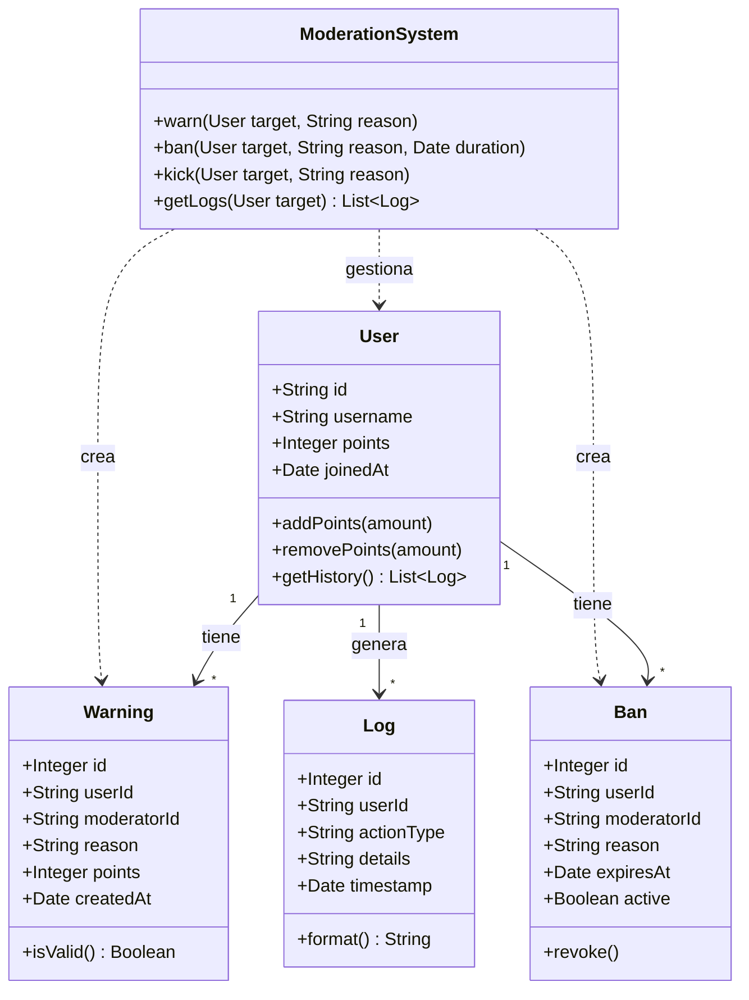

# Discord Moderation Bot

Un bot de moderación avanzada para Discord, diseñado para mantener servidores seguros y bien organizados mediante automatización y registros detallados.

---

## 1. Título

**Advanced Discord Moderator**

---

## 2. Descripción

Este bot proporciona un conjunto robusto de herramientas de moderación, incluyendo sistemas de advertencias, baneos temporales y permanentes, y un registro de historial completo. Su objetivo es automatizar tareas repetitivas de gestión de comunidad y asegurar un ambiente justo y libre de spam o toxicidad.

**Funcionalidades principales:**

- **Sistema de advertencias (Warnings):** Cada advertencia se almacena con un ID único, el moderador responsable, la razón y el peso en puntos.
- **Baneos (Bans):** Soporte para baneos temporales (*temp-bans*) y permanentes, con verificación automática de expiración.
- **Historial (Logs):** Un registro inmutable de todas las acciones tomadas contra un usuario.
- **Sistema de puntos:** Escalado automático de castigos según la acumulación de infracciones.
- **Auto-moderación configurable:** Filtros de palabras, límites de menciones, detección de invitaciones y protección contra flood.
.
---

## 3. Motivación

La gestión de grandes comunidades en Discord requiere herramientas que vayan más allá de las funciones básicas de moderación manual. La motivación principal de este proyecto es:

- **Automatizar** la detección de comportamientos indeseados.
- **Mantener un historial persistente** de las acciones de los usuarios para tomar decisiones informadas.
- **Ofrecer transparencia** a través de logs detallados y accesibles.
- **Proveer un sistema justo** mediante puntos y advertencias graduadas.

---

## 4. Diagrama Entidad-Relación (E-R)

Representación del modelo relacional de la base de datos con sus entidades, atributos y relaciones.

---

## 5. Diagrama E-R en UML (Diagrama de Clases)

Representación orientada a objetos del sistema de moderación, mostrando las clases con sus atributos, métodos y relaciones.

## 6. Bot de Moderación Avanzada

Este bot implementa un sistema completo de moderación basado en bases de datos relacionales para persistencia y trazabilidad.

### Base de Datos
El esquema de base de datos está diseñado para soportar operaciones críticas de moderación:
- **Advertencias (Warnings)**: Cada advertencia se almacena con un ID único, el moderador responsable, la razón y el peso (puntos).
- **Baneos (Bans)**: Soporte para *temp-bans* (baneos temporales) y permanentes, con verificación automática de expiración.
- **Historial (History/Logs)**: Un registro inmutable de todas las acciones tomadas contra un usuario.

### Funciones Principales

#### 🔸 Warn Automático
El sistema puede emitir advertencias automáticamente basadas en reglas predefinidas (ej. spam, malas palabras).
- **Trigger**: Detección de patrón (Regex) o frecuencia de mensajes.
- **Acción**: Envío de MD al usuario y registro en base de datos.

#### 🔸 Sistema de Puntos
Cada infracción suma puntos al perfil del usuario.
- **Escalado de Castigos**:
    - 3 puntos: Mute temporal (1h).
    - 5 puntos: Kick.
    - 10 puntos: Ban temporal (24h).
    - 20 puntos: Ban permanente.

#### 🔸 Auto-moderación Configurable
Los administradores pueden ajustar la sensibilidad del bot:
- Filtros de palabras prohibidas.
- Límites de menciones masivas.
- Detección de invitaciones a otros servidores.
- Protección contra flood.

#### 🔸 Logs Persistentes
A diferencia de los logs de auditoría de Discord (que pueden ser limitados o rotar), este sistema guarda logs indefinidamente en la base de datos externa para futuras referencias y análisis forense.

### Prácticas de Ingeniería

#### Registro Estructurado (Structured Logging)
Los logs no son solo texto plano; se guardan con metadatos estructurados (JSON/Columnas) permitiendo búsquedas precisas por tipo de evento, severidad o actor.

#### Consultas por Usuario
Comandos optimizados para recuperar todo el historial de un usuario específico instantáneamente:
- `!history @usuario` -> Muestra warnings, kicks y bans previos.
- `!check @usuario` -> Muestra estado actual y puntos acumulados.

#### Filtrado de Datos
Capacidad de generar reportes filtrados:
- "Mostrar todos los bans del último mes".
- "Listar usuarios con más de 10 puntos de infracción".
- "Ver acciones realizadas por el moderador X".

## Tecnologías Usadas
- **Lenguaje**: TypeScript / Node.js (o Python según preferencia de implementación).
- **Librería Discord**: Discord.js / discord.py.
- **Base de Datos**: PostgreSQL / SQLite (para entornos locales).
- **ORM**: Prisma / Sequelize / TypeORM.
- **Contenedores**: Docker (opcional para despliegue).

/
