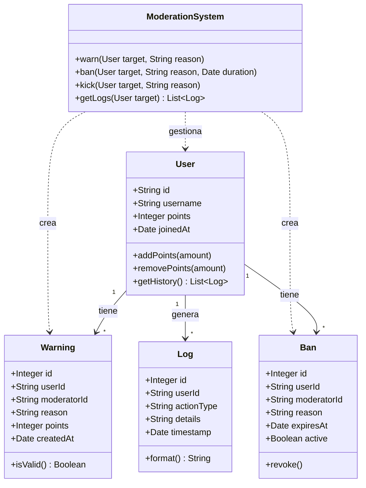

# Discord Moderation Bot

Un bot de moderación avanzada para Discord, diseñado para mantener servidores seguros y bien organizados mediante automatización y registros detallados.

---

## 1. Título

**Advanced Discord Moderator**

---

## 2. Descripción

Este bot proporciona un conjunto robusto de herramientas de moderación, incluyendo sistemas de advertencias, baneos temporales y permanentes, y un registro de historial completo. Su objetivo es automatizar tareas repetitivas de gestión de comunidad y asegurar un ambiente justo y libre de spam o toxicidad.

**Funcionalidades principales:**

- **Sistema de advertencias (Warnings):** Cada advertencia se almacena con un ID único, el moderador responsable, la razón y el peso en puntos.
- **Baneos (Bans):** Soporte para baneos temporales (*temp-bans*) y permanentes, con verificación automática de expiración.
- **Historial (Logs):** Un registro inmutable de todas las acciones tomadas contra un usuario.
- **Sistema de puntos:** Escalado automático de castigos según la acumulación de infracciones.
- **Auto-moderación configurable:** Filtros de palabras, límites de menciones, detección de invitaciones y protección contra flood.
.
---

## 3. Motivación

La gestión de grandes comunidades en Discord requiere herramientas que vayan más allá de las funciones básicas de moderación manual. La motivación principal de este proyecto es:

- **Automatizar** la detección de comportamientos indeseados.
- **Mantener un historial persistente** de las acciones de los usuarios para tomar decisiones informadas.
- **Ofrecer transparencia** a través de logs detallados y accesibles.
- **Proveer un sistema justo** mediante puntos y advertencias graduadas.

---

## 4. Diagrama Entidad-Relación (E-R)

---

## 5. Diagrama E-R en UML (Diagrama de Clases)

